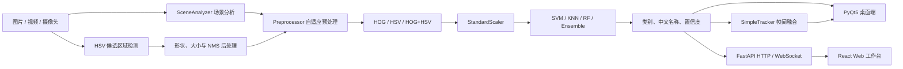

# 智路视界 — 交通标志分类识别系统

**智路视界（Traffic Vision）** 是一套面向 GTSRB 43 类交通标志的传统计算机视觉识别系统。项目以 **OpenCV + HOG/HSV + scikit-learn** 为核心，同时提供 **PyQt5 桌面端**与 **React + FastAPI Web 端**，覆盖数据处理、特征提取、模型训练、图片识别、候选区域检测、视频跟踪、复杂场景增强、评估和性能验证。

> 本项目不依赖深度学习框架，适用于课程设计、传统视觉算法验证和轻量化识别演示，不应直接用于自动驾驶等安全关键场景。

---

## 项目特性

- 内置 GTSRB `0~42` 共 **43 类交通标志中文标签**。
- 支持 `hog`、`hsv`、`hog+hsv` 三种特征模式。
- 支持 SVM、KNN、RandomForest 和软投票集成模型。
- 支持类别权重、SVM 网格搜索和贝叶斯超参搜索。
- 模型、StandardScaler、标签、特征配置和训练摘要统一保存为 `.joblib` Bundle。
- 支持单图预测、Top-K、文件夹批量预测和有界结果缓存。
- 使用 HSV 红/蓝掩膜、轮廓、形状、面积和 NMS 完成候选区域检测。
- 视频和摄像头模式集成 IoU 跟踪、Track ID、类别多数投票及置信度平滑。
- 支持低光照、低对比/雾、运动模糊和噪声的场景分析与自适应增强。
- 提供 PyQt5 桌面界面和 React Web 工作台两套操作界面。

---

## 当前模型状态

默认模型路径：

```text
traffic_sign_system/models/artifacts/svm_hog+hsv.joblib
```

当前工作区训练日志记录：

| 项目 | 当前记录 |
| --- | ---: |
| 模型 | SVM（RBF） |
| 特征 | HOG + HSV |
| 特征维度 | 1828 |
| 训练样本 | 26,661 |
| 验证样本 | 4,706 |
| 测试样本 | 7,842 |
| 验证准确率 | 99.62% |
| 测试准确率 | 99.58% |
| 模型大小 | 约 233 MB |

> 以上验证集和测试集来自本地 GTSRB `Train` 数据的分层切分，不是独立官方测试集结果。数据集和模型文件体积较大，默认被 `.gitignore` 忽略。

---

## 技术栈

| 模块 | 技术 |
| --- | --- |
| 开发语言 | Python 3.10 / 3.11 / 3.12、TypeScript |
| 图像处理 | OpenCV 4.10、Pillow |
| 科学计算 | NumPy、Pandas、SciPy |
| 机器学习 | scikit-learn、scikit-optimize、joblib |
| 特征算法 | HOG、HSV Color Histogram、HOG/HSV Feature Fusion |
| 分类模型 | SVM、KNN、RandomForest、Soft Voting Ensemble |
| 桌面界面 | PyQt5 |
| Web 后端 | FastAPI、Uvicorn、Multipart、WebSocket |
| Web 前端 | React 18、TypeScript、Vite、React Router |
| 前端状态与请求 | Zustand、TanStack Query |
| 图表与图标 | Recharts、Lucide React |
| 可视化 | Matplotlib |
| 测试 | Python unittest、TypeScript/Vite Build |

---

## 系统流程



### 核心识别链路

1. OpenCV 读取并校验 BGR 图像。
2. `SceneAnalyzer` 计算亮度、对比度、模糊度和噪声分数。
3. `Preprocessor` 完成 Resize、灰度化、CLAHE、归一化和可选锐化。
4. `FeatureBuilder` 提取 HOG、HSV 或 HOG/HSV 融合特征。
5. 使用 Bundle 中保存的 `StandardScaler` 缩放特征。
6. 分类器输出类别编号、中文名称和置信度。
7. 场景检测模式先定位候选框，再对候选区域分类。
8. 视频/摄像头模式通过 `SimpleTracker` 稳定连续帧结果。

---

## 项目结构

```text
.
├── README.md
├── requirements.txt
├── frontend/                         # React + TypeScript Web 前端
│   ├── package.json
│   ├── vite.config.ts                # /api 与 /ws 开发代理
│   └── src/
│       ├── app/                      # Router 与 Provider
│       ├── components/               # 页面框架、上传、检测框和结果组件
│       ├── pages/                    # 单图、实时、批量、分析、模型页面
│       ├── lib/                      # API、类型与格式化函数
│       └── store/                    # Zustand 状态管理
│
└── traffic_sign_system/
    ├── __main__.py                   # python -m traffic_sign_system
    ├── main.py                       # PyQt5 桌面入口
    ├── api/
    │   ├── __main__.py               # python -m traffic_sign_system.api
    │   └── app.py                    # FastAPI 服务
    ├── config/
    │   ├── settings.py               # 全局参数和目录配置
    │   └── labels.py                 # GTSRB 43 类中文标签
    ├── data_processing/
    │   ├── data_loader.py            # 数据读取和分层切分
    │   ├── preprocessing.py          # 常规与自适应预处理
    │   ├── augmentation.py           # 仿射、透视、模糊和遮挡增强
    │   └── dataset_statistics.py     # 数据统计
    ├── features/
    │   ├── hog_extractor.py
    │   ├── color_extractor.py
    │   └── feature_fusion.py
    ├── models/
    │   ├── model_manager.py          # Bundle 保存、加载与校验
    │   ├── train_svm.py
    │   ├── train_knn.py
    │   ├── train_random_forest.py
    │   ├── train_ensemble.py
    │   └── artifacts/                # 本地模型和生成结果
    ├── recognition/
    │   ├── predictor.py              # 单图、批量与缓存推理
    │   ├── sign_detector.py          # 候选检测和后处理
    │   ├── tracker.py                # IoU 跟踪和帧间融合
    │   ├── scene_aware.py            # 场景质量分析
    │   ├── video_recognizer.py       # 视频检测与跟踪
    │   └── camera_recognizer.py      # 摄像头 ROI 识别
    ├── evaluation/                   # 指标、混淆矩阵和错误分析
    ├── scripts/                      # 训练、评估、预测和验证命令
    ├── tests/                        # 自动化测试及测试资源
    └── ui/                           # PyQt5 窗口、Worker 和主题
```

---

## 环境安装

### Python 环境

推荐 Python `3.10~3.12`。

PowerShell：

```powershell
python -m venv .venv
.\.venv\Scripts\Activate.ps1
python -m pip install --upgrade pip
pip install -r requirements.txt
```

Linux / macOS：

```bash
python3 -m venv .venv
source .venv/bin/activate
python -m pip install --upgrade pip
pip install -r requirements.txt
```

### Web 前端环境

建议使用 Node.js `18+`：

```powershell
cd frontend
npm install
cd ..
```

如果 PowerShell 因执行策略无法运行 `npm.ps1`，可以使用：

```powershell
cd frontend
npm.cmd install
```

---

## 快速启动

### 启动 PyQt5 桌面端

在项目根目录执行：

```powershell
python -m traffic_sign_system
```

桌面端会自动尝试加载：

```text
traffic_sign_system/models/artifacts/svm_hog+hsv.joblib
```

桌面界面当前支持：

- 选择和异步加载模型 Bundle；
- 单图识别与 Top-3 结果；
- 原图和预处理图对比；
- HSV 候选区域场景检测；
- 文件夹批量识别；
- 视频与摄像头识别；
- 暂停、停止和保存识别视频；
- IoU 跟踪框和 Track ID；
- 自适应增强开关；
- 亮度、模糊度、FPS 和耗时状态；
- 历史记录和浅色/深色主题。

### 启动 FastAPI 后端

```powershell
python -m traffic_sign_system.api
```

默认地址：

```text
API:     http://127.0.0.1:8000
OpenAPI: http://127.0.0.1:8000/docs
```

## 性能与 ONNX 加速

FastAPI 后端默认采用 **ProcessPoolExecutor** 跑推理（`traffic_sign_system/api/inference_pool.py`），
所有 CPU 密集任务（SVM/RF/KNN 推理、HOG 提取、检测）都在独立工作进程中执行，不再与
HTTP/WS 路由共享 starlette 默认线程池。默认 worker 数 = `min(4, cpu_count())`，可通过环境变量覆盖：

```powershell
# 8 核机器上拉满
$env:INFERENCE_POOL_WORKERS = "8"
python -m traffic_sign_system.api
```

Lifespan 启动时会自动 **预热** 默认 bundle（`svm_hog+hsv.joblib`），每个 worker
进程各自加载一次后常驻内存，避免首请求加载模型带来的秒级延迟。

### ONNX 加速

如果 `models/artifacts/<bundle>.onnx` 与 `<bundle>.joblib` 共存，
`InferencePool` 会自动选用 `OnnxPredictor`（onnxruntime 后端）；否则回退到 joblib。
ONNX 路径相比 sklearn 通常提速 **2~10×**，且天然脱离 GIL。

导出命令：

```powershell
# 一次性导出所有 bundle（需先 pip install onnxruntime skl2onnx）
python -m traffic_sign_system.scripts.export_onnx --all --report

# 仅导出 SVM
python -m traffic_sign_system.scripts.export_onnx svm_hog+hsv.joblib
```

输出 `<bundle>.onnx` 放在同目录；对集成模型还会写出 `<bundle>__<name>.onnx` 子模型文件。
重启 API 后新 bundle 自动生效。

### 内存预算

每个 worker 加载一份模型，常驻内存：

| 模型 | 大小 | 4 workers RSS（估） |
| --- | --- | --- |
| `svm_hog+hsv.joblib` | 234 MB | ~1.2 GB |
| `rf_hog+hsv.joblib`  | 457 MB | ~1.8 GB |
| `knn_hog+hsv.joblib` | 187 MB | ~1.0 GB |

如部署到内存受限环境，请降低 `INFERENCE_POOL_WORKERS`。

### WS 实时多目标检测与跟踪

`/ws/stream` 使用进程池执行 `SignDetector` 多目标检测与分类，每个 WebSocket 连接
独立维护 `SimpleTracker`，返回稳定的 `track_id`、平滑检测框、类别投票结果和
短暂丢失状态。前端使用 SVG 在摄像头或本地视频上绘制多个检测框，可点击检测框或
目标列表查看类别、置信度和 Track ID。

响应帧包含 `detections`、`detection_count`、`tracked_count`、`tracker_ms`、`image` 和
`processed_frames` 等字段。跳帧时复用最近的跟踪结果，避免频繁推理。


### 错例纠正与反馈闭环

Web 端“反馈闭环”页面可从当前会话历史中选择识别结果，标记“识别正确”或“错例”，
并为错例选择真实类别、填写备注。反馈数据使用 SQLite 保存到 `runtime/feedback.db`，
支持“待复核 → 已复核 → 已导出”状态流转，可导出 UTF-8 CSV 作为后续重训和混淆分析的标注清单。

### 启动 React Web 前端

打开另一个终端：

```powershell
cd frontend
npm run dev
```

访问：

```text
http://127.0.0.1:5173
```

PowerShell 如拦截 npm 脚本，可执行：

```powershell
npm.cmd run dev
```

Web 工作台包含：

| 页面 | 功能 |
| --- | --- |
| 单图识别 | 图片上传、Top-5 分类和候选框检测 |
| 实时识别 | 摄像头或本地视频多目标检测、Track ID 跟踪与检测框交互 |
| 批量处理 | 最多 50 张图片批量识别和 CSV 导出 |
| 反馈闭环 | 错例标记、真实类别纠正、复核状态和 CSV 导出 |
| 数据分析 | 当前会话类别、置信度、来源和耗时图表 |
| 模型管理 | Bundle 加载、缓存清理和 43 类标签浏览 |

### Web 生产构建

```powershell
cd frontend
npm run build
npm run preview
```

Vite 开发服务器会将 `/api` 和 `/ws` 代理到 `127.0.0.1:8000`。

---

## 数据集准备

项目使用 GTSRB 数据集，推荐目录结构：

```text
traffic_sign_system/dataset/
├── train/
│   ├── Train/
│   │   ├── 0/*.png
│   │   ├── 1/*.png
│   │   └── ...
│   ├── Test/                         # 可选：官方测试图片
│   ├── Train.csv
│   ├── Test.csv
│   └── Meta.csv
└── test/
    └── Test/                         # 同样支持该测试目录
```

当前本地 CSV 记录：

| 文件 | 记录数 |
| --- | ---: |
| `Train.csv` | 39,209 |
| `Test.csv` | 12,630 |
| `Meta.csv` | 43 |

数据集默认不会提交到 Git。只有 `Test.csv` 而没有实际 `Test/*.png` 时，无法执行独立测试集评估。

---

## 模型训练

### 推荐训练命令

```powershell
python -m traffic_sign_system.scripts.train `
  --model svm `
  --mode hog+hsv `
  --class-weight balanced `
  --output traffic_sign_system/models/artifacts/svm_hog+hsv.joblib
```

### 小样本烟雾训练

```powershell
python -m traffic_sign_system.scripts.train `
  --model svm `
  --mode hog+hsv `
  --max-samples 2000 `
  --output traffic_sign_system/models/artifacts/svm_smoke.joblib
```

### KNN

```powershell
python -m traffic_sign_system.scripts.train `
  --model knn `
  --mode hog+hsv `
  --n-neighbors 5
```

### RandomForest

```powershell
python -m traffic_sign_system.scripts.train `
  --model rf `
  --mode hog+hsv `
  --n-estimators 300 `
  --n-jobs -1
```

### 软投票集成

```powershell
python -m traffic_sign_system.scripts.train `
  --mode hog+hsv `
  --ensemble `
  --n-jobs -1
```

集成模型由 SVM、KNN 和 RandomForest 组成，并按验证集准确率设置权重。

### SVM 网格搜索

```powershell
python -m traffic_sign_system.scripts.train `
  --model svm `
  --mode hog+hsv `
  --grid-search `
  --cv-folds 3 `
  --C-grid 1 10 30 `
  --gamma-grid scale 0.001 0.01
```

### 贝叶斯超参搜索

```powershell
python -m traffic_sign_system.scripts.hyperopt_search `
  --mode hog+hsv `
  --n-calls 30 `
  --n-initial-points 10 `
  --cv-folds 3
```

---

## 单图和批量预测

### 命令行预测

```powershell
python -m traffic_sign_system.scripts.predict_one `
  --bundle traffic_sign_system/models/artifacts/svm_hog+hsv.joblib `
  --image path/to/sign.png
```

### Python 调用

```python
import cv2

from traffic_sign_system.recognition.predictor import Predictor
from traffic_sign_system.recognition.sign_detector import SignDetector, draw_detections

predictor = Predictor(
    "traffic_sign_system/models/artifacts/svm_hog+hsv.joblib",
    use_cache=True,
    cache_maxsize=512,
)

image = cv2.imread("path/to/sign.png")
result = predictor.predict(image)
print(result)
# {"class_id": 14, "class_name": "停车让行", "confidence": 0.97}

batch_results = predictor.predict_batch([image, image])
print(predictor.cache_stats())

detector = SignDetector(predictor)
detections = detector.detect(image)
annotated = draw_detections(image, detections)
cv2.imwrite("detection_result.png", annotated)
```

---

## 候选区域检测与后处理

`SignDetector` 的处理流程：

1. 根据 HSV 红色和蓝色范围生成颜色掩膜；
2. 通过形态学处理清理掩膜；
3. 提取轮廓并检查面积、宽高比和圆度；
4. 将候选区域交给 `Predictor` 分类；
5. 根据类别验证圆形、三角形和八边形等轮廓形状；
6. 检查检测框相对面积是否符合类别范围；
7. 使用 NMS 去除重叠候选；
8. 过滤低置信度且形状不匹配的候选。

---

## 帧间跟踪与融合

`SimpleTracker` 使用 IoU 完成轻量多目标跟踪，不依赖深度学习。

| 参数 | 默认值 | 作用 |
| --- | ---: | --- |
| `iou_threshold` | 0.3 | 检测与轨迹匹配阈值 |
| `max_lost` | 5 | 轨迹最多保留的丢失帧数 |
| `history_size` | 7 | 类别多数投票窗口 |
| `bbox_smoothing` | 0.65 | 边界框指数平滑系数 |
| `confidence_smoothing` | 0.65 | 置信度指数平滑系数 |

跟踪器会：

- 按 IoU 从高到低进行一对一匹配；
- 为新目标创建稳定的 `track_id`；
- 对历史类别进行多数投票；
- 平滑边界框和置信度；
- 暂时保留丢失轨迹；
- 使用虚线框显示 `lost_count > 0` 的轨迹；
- 超过 `max_lost` 后删除轨迹。

### 视频稳定性验证

```powershell
python -m traffic_sign_system.scripts.verify_tracking `
  traffic_sign_system/tests/assets/tracking_validation.mp4 `
  traffic_sign_system/models/artifacts/svm_hog+hsv.joblib `
  --max-frames 60 `
  --adaptive
```

脚本会输出：

- 原始类别跳变率；
- 跟踪后的类别跳变率；
- 跳变率降低比例；
- Track ID 数量；
- 平均跟踪耗时。

当前内置验证样例曾记录原始跳变率 `40.68%`、跟踪后 `0%`，平均跟踪耗时约 `0.06 ms/帧`。实际结果取决于模型、视频和运行环境。

---

## 场景感知与自适应增强

`SceneAnalyzer` 输出：

```python
{
    "brightness": 53.0,
    "contrast": 31.2,
    "blur_score": 42.5,
    "noise_score": 0.08,
    "degradations": ["low_light", "fog", "blur"],
    "analysis_seconds": 0.0018,
}
```

默认策略：

| 退化场景 | 判断条件 | 自适应处理 |
| --- | --- | --- |
| 低光照 | 平均亮度 `< 80` | CLAHE clip 提升到 `4.0` |
| 低对比/雾 | 灰度标准差 `< 40` | CLAHE + Min-Max 归一化 |
| 模糊 | Laplacian 方差 `< 50` | 关闭高斯模糊并执行锐化 |
| 噪声 | 高频能量比超过阈值 | 启用适当平滑并显示噪声状态 |

### 低光照验证

```powershell
python -m traffic_sign_system.scripts.verify_robustness `
  traffic_sign_system/models/artifacts/svm_hog+hsv.joblib
```

测试图片：


历史验证中，该样例由错误类别 11、置信度 `14.47%`，调整为真实类别 23、置信度 `34.46%`。该数据用于验证流程，不代表所有图片都能得到相同提升。

---

## 模型评估

准备好 GTSRB 官方测试图片后执行：

```powershell
python -m traffic_sign_system.scripts.evaluate `
  --bundle traffic_sign_system/models/artifacts/svm_hog+hsv.joblib `
  --data traffic_sign_system/dataset/train/Test `
  --labels-csv traffic_sign_system/dataset/train/Test.csv `
  --out traffic_sign_system/models/artifacts/eval
```

评估结果包括：

- `metrics.json`
- `confusion_matrix.png`
- `errors.csv`
- Accuracy、Macro-F1、Weighted-F1 和分类报告

---

## 性能基准

```powershell
python -m traffic_sign_system.scripts.benchmark `
  --bundle traffic_sign_system/models/artifacts/svm_hog+hsv.joblib
```

基准脚本覆盖：

- 单图重复推理；
- 缓存命中统计；
- 不同 Batch Size；
- 视频帧跳过参数；
- FPS 和平均延迟。

结果默认写入：

```text
traffic_sign_system/models/artifacts/benchmark.json
```

---

## FastAPI 接口

| 方法 | 路径 | 功能 |
| --- | --- | --- |
| `GET` | `/api/health` | 服务与模型状态 |
| `GET` | `/api/labels` | 获取 43 类标签 |
| `GET` | `/api/models` | 枚举模型 Bundle |
| `POST` | `/api/models/load` | 加载并预热模型 |
| `DELETE` | `/api/models/cache` | 清空推理缓存 |
| `POST` | `/api/predict` | 单图分类与 Top-K |
| `POST` | `/api/detect` | 候选区域检测 |
| `POST` | `/api/batch` | 最多 50 张图片批量分类 |
| `GET/POST` | `/api/feedback` | 查询或提交人工纠正反馈 |
| `PATCH/DELETE` | `/api/feedback/{id}` | 更新反馈状态或删除记录 |
| `GET` | `/api/feedback/export` | 导出反馈 CSV |
| `WS` | `/ws/stream` | 浏览器视频帧实时多目标检测与跟踪 |

接口限制：

- 单张图片最大 `20 MB`；
- 支持 JPEG、PNG、WebP 和 BMP；
- 仅允许加载 `traffic_sign_system/models/artifacts/` 中的 `.joblib` 文件。

> WebSocket 使用 `SignDetector + SimpleTracker` 完成整帧多目标检测与跟踪，并支持 `skip_frames`；每个连接独立维护 Track ID，前端可同时显示多个检测框。

---

## 默认配置

配置文件：`traffic_sign_system/config/settings.py`

| 配置 | 默认值 |
| --- | --- |
| `IMG_SIZE` | 64 |
| `HOG_WIN_SIZE` | `(64, 64)` |
| `HOG_BLOCK_SIZE` | `(16, 16)` |
| `HOG_BLOCK_STRIDE` | `(8, 8)` |
| `HOG_CELL_SIZE` | `(8, 8)` |
| `HOG_NBINS` | 9 |
| `SVM_C` | 10.0 |
| `SVM_KERNEL` | `rbf` |
| `SVM_GAMMA` | `scale` |
| `TEST_SIZE` | 0.20 |
| `VAL_SIZE` | 0.15 |
| `RANDOM_STATE` | 42 |

训练后的 Bundle 会保存独立的 `feature_config`，推理时优先使用 Bundle 内的训练配置。

---

## 自动化测试

### Python 测试

```powershell
python -m unittest traffic_sign_system.tests.test_tracking_and_scene -v
```

当前覆盖 8 项：

- IoU 匹配和 Track ID；
- 类别投票和丢失轨迹生命周期；
- 跟踪平均耗时小于 2 ms/帧；
- VideoRecognizer 跟踪集成；
- 低光照 CLAHE 参数调整；
- 模糊检测和锐化；
- 候选框形状后处理；
- 丢失轨迹虚线绘制。

### 前端构建验证

```powershell
cd frontend
npm run build
```

PowerShell 如拦截 `npm.ps1`：

```powershell
npm.cmd run build
```

当前工作区验证结果：Python 8 项测试全部通过，React/Vite 生产构建成功。

---

## 常见问题

### 找不到默认模型

将训练好的 Bundle 放入：

```text
traffic_sign_system/models/artifacts/
```

默认文件名为 `svm_hog+hsv.joblib` 时，桌面端和 API 会优先加载。

### 找不到训练数据

确认目录存在：

```text
traffic_sign_system/dataset/train/Train/<ClassId>/*.png
```

也可以通过训练参数 `--train-dir` 指定其他目录。

### SVM 训练时间过长

先使用 `--max-samples 2000` 验证训练链路。完整的 RBF SVM + HOG/HSV 模型训练时间较长，模型文件也较大。

### 评估命令找不到图片

`Test.csv` 只是标注文件，还需要准备实际的 `Test/*.png` 图片。

### 浏览器摄像头无法打开

确认浏览器已获得摄像头权限。远程访问时通常需要 HTTPS 安全上下文。

### PowerShell 无法运行 npm

使用 `npm.cmd run dev` 或 `npm.cmd run build`，绕过被执行策略拦截的 `npm.ps1`。

### HSV-only 模型不能进行灰度自适应增强对比

`hsv` 模式没有 HOG 灰度预处理器。复杂场景验证应使用 `hog` 或 `hog+hsv` 模型。

---

## 使用说明

本仓库当前没有单独的开源许可证文件，默认仅用于学习、课程设计和技术演示。公开发布、商用或二次分发前，请补充明确的许可证，并确认 GTSRB 数据集及所有第三方依赖的授权条款。
