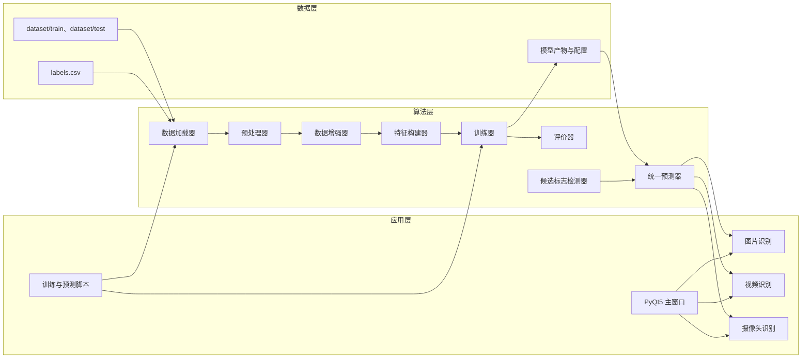
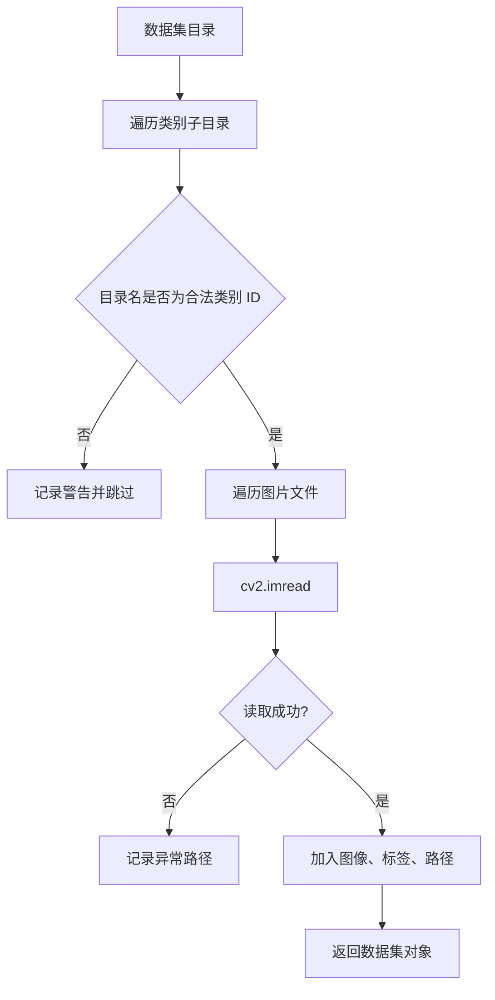
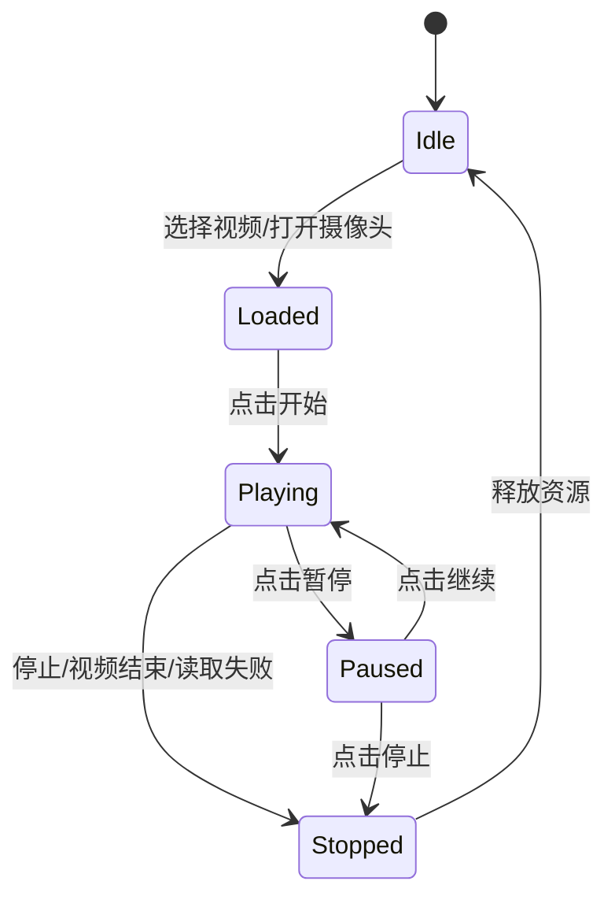
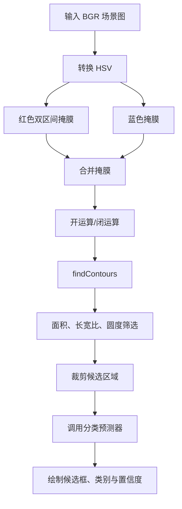
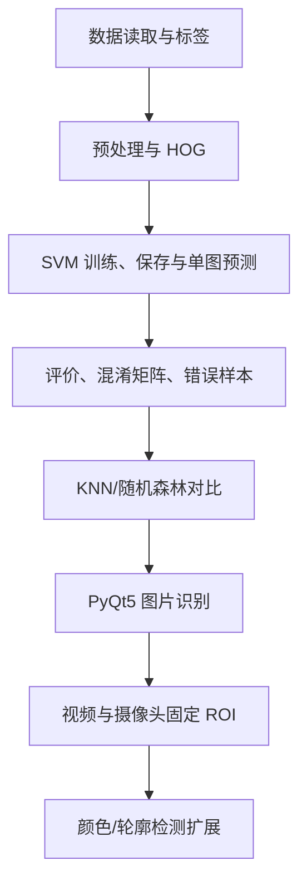

# 交通标志分类识别系统——详细设计

## 1. 设计概述

### 1.1 设计目标
系统采用“传统计算机视觉 + 传统机器学习”架构：OpenCV 负责图像预处理与可选候选区域定位；HOG 和 HSV 颜色直方图负责特征构建；SVM 负责多类别分类；PyQt5 提供图片、视频和摄像头场景下的可视化操作。

设计原则：
1. **分类优先**：主流程输入为单个已裁剪交通标志。
2. **模块解耦**：数据、预处理、特征、模型、评价、识别和界面分层实现。
3. **配置驱动**：路径、预处理、HOG、模型等参数集中管理。
4. **可复现**：固定随机种子，训练时保存模型依赖的 scaler、标签和特征配置。
5. **可扩展**：检测器只输出候选区域，分类器只负责类别识别；后续可替换检测器。

### 1.2 总体架构



## 2. 目录与文件设计

```text
traffic_sign_system/
├── main.py                         # PyQt5 程序入口
├── requirements.txt                # Python 依赖
├── README.md                       # 项目说明
├── config/
│   ├── settings.py                 # 路径、预处理、特征、模型参数
│   └── labels.py                   # 默认类别映射/标签加载
├── dataset/
│   ├── train/<class_id>/           # 训练图片
│   ├── test/                       # 可选独立测试集
│   └── labels.csv
├── data_processing/
│   ├── data_loader.py
│   ├── preprocessing.py
│   ├── augmentation.py
│   └── dataset_statistics.py
├── features/
│   ├── hog_extractor.py
│   ├── color_extractor.py
│   └── feature_fusion.py
├── models/
│   ├── train_svm.py
│   ├── train_knn.py
│   ├── train_random_forest.py
│   ├── model_manager.py
│   └── artifacts/
├── evaluation/
│   ├── evaluator.py
│   ├── confusion_matrix.py
│   ├── error_analysis.py
│   └── comparison.py
├── recognition/
│   ├── predictor.py
│   ├── image_recognizer.py
│   ├── video_recognizer.py
│   ├── camera_recognizer.py
│   └── sign_detector.py
├── ui/
│   ├── main_window.py
│   ├── image_utils.py
│   └── workers.py
├── outputs/{charts,images,videos,records,logs}/
└── tests/
    ├── test_data_loader.py
    ├── test_preprocessing.py
    ├── test_features.py
    ├── test_prediction.py
    └── test_model_manager.py
```

## 3. 配置与数据模型设计

### 3.1 配置设计：`config/settings.py`

```python
from dataclasses import dataclass
from pathlib import Path

BASE_DIR = Path(__file__).resolve().parents[1]

@dataclass(frozen=True)
class ImageConfig:
    width: int = 64
    height: int = 64
    gaussian_blur_ksize: tuple[int, int] = (3, 3)
    use_clahe: bool = True
    clahe_clip_limit: float = 2.0
    clahe_tile_grid_size: tuple[int, int] = (8, 8)

@dataclass(frozen=True)
class HOGConfig:
    win_size: tuple[int, int] = (64, 64)
    block_size: tuple[int, int] = (16, 16)
    block_stride: tuple[int, int] = (8, 8)
    cell_size: tuple[int, int] = (8, 8)
    nbins: int = 9

@dataclass(frozen=True)
class TrainConfig:
    test_size: float = 0.2
    random_state: int = 42
    svm_c: float = 10.0
    svm_kernel: str = "rbf"
    svm_gamma: str = "scale"
```

配置校验规则：图像尺寸必须与 HOG 的 `win_size` 一致；HOG 的 block、stride、cell 组合必须合法；预测使用的 HSV bins、特征模式和特征维度必须与训练时保存的元信息一致。

### 3.2 数据对象

```python
from dataclasses import dataclass
from pathlib import Path
import numpy as np

@dataclass
class ImageSample:
    path: Path
    class_id: int
    class_name: str
    image: np.ndarray | None = None

@dataclass
class PredictionResult:
    class_id: int
    class_name: str
    confidence: float | None
    source: str
```

标签文件采用 `class_id,class_name` 格式。训练结果还应记录模型名称、特征模式、训练时间、样本数量、特征维度和 Accuracy。

### 3.3 模型包

每次训练生成独立版本目录，避免覆盖：

```text
models/artifacts/svm_hog_hsv_20260710_162000/
├── classifier.joblib
├── scaler.joblib
├── class_names.json
├── feature_config.json
├── train_summary.json
├── classification_report.json
└── confusion_matrix.png
```

`feature_config.json` 必须保存图像尺寸、预处理开关、HOG 参数、HSV bins、特征模式、特征维度和模型名；预测器加载时据此复现训练阶段的特征管线。

## 4. 核心模块详细设计

### 4.1 数据加载：`data_processing/data_loader.py`

**职责**：读取标签、扫描类别目录、读取图片、记录异常文件，返回图像、标签和路径。

```python
from pathlib import Path
import numpy as np

IMAGE_SUFFIXES = {".jpg", ".jpeg", ".png", ".ppm", ".bmp"}

def load_label_map(csv_path: Path) -> dict[int, str]:
    """读取 class_id,class_name 标签文件。"""

def scan_dataset(root: Path, label_map: dict[int, str]) -> list[ImageSample]:
    """扫描按 class_id 分目录的数据集。"""

def read_image(path: Path) -> np.ndarray | None:
    """使用 cv2.imread 读取 BGR 图像；失败时返回 None。"""

def load_dataset(root: Path, label_map: dict[int, str]) -> tuple[list[np.ndarray], np.ndarray, list[Path], list[Path]]:
    """返回 images、labels、valid_paths、invalid_paths。"""
```



损坏图片跳过并写入 `outputs/logs/invalid_images.log`；数据集为空时抛出 `ValueError`。

### 4.2 预处理：`data_processing/preprocessing.py`

默认 HOG 主流程：`BGR → resize(64×64) → 灰度化 → GaussianBlur(3×3) → CLAHE → gray`。

颜色特征分支：`BGR → resize(64×64) → HSV → 颜色直方图`。

```python
import cv2
import numpy as np

class ImagePreprocessor:
    def __init__(self, config: ImageConfig):
        self.config = config
        self.clahe = cv2.createCLAHE(
            clipLimit=config.clahe_clip_limit,
            tileGridSize=config.clahe_tile_grid_size,
        )

    def resize(self, image: np.ndarray) -> np.ndarray: ...
    def preprocess_gray(self, image: np.ndarray) -> np.ndarray: ...
    def preprocess_color(self, image: np.ndarray) -> np.ndarray: ...
    def process(self, image: np.ndarray, mode: str = "hog_hsv") -> dict[str, np.ndarray]: ...
```

实现要求：不修改输入数组；CLAHE 仅用于单通道灰度图；颜色直方图必须来自缩放后的 BGR→HSV 图像；训练和预测调用同一套预处理配置。

### 4.3 数据增强：`data_processing/augmentation.py`

| 增强 | 建议范围 | 默认 |
|---|---:|---|
| 旋转 | ±5°、±10° | 可选 |
| 平移 | 图像宽高的 ±5% | 可选 |
| 缩放 | 0.95～1.05 | 可选 |
| 亮度/对比度 | 小幅改变 | 可选 |
| 模糊/噪声 | 轻微 | 可选 |
| 水平翻转 | 禁止 | 否 |

```python
class Augmenter:
    def __init__(self, random_state: int = 42): ...
    def rotate(self, image: np.ndarray, angle: float) -> np.ndarray: ...
    def translate(self, image: np.ndarray, tx: float, ty: float) -> np.ndarray: ...
    def augment(self, image: np.ndarray) -> list[np.ndarray]: ...
```

增强只能在完成数据划分后应用于训练集，验证集与测试集不得增强。

### 4.4 特征提取：`features/`

#### HOG 提取器

```python
class HOGExtractor:
    def __init__(self, config: HOGConfig):
        self.descriptor = cv2.HOGDescriptor(
            _winSize=config.win_size,
            _blockSize=config.block_size,
            _blockStride=config.block_stride,
            _cellSize=config.cell_size,
            _nbins=config.nbins,
        )

    def extract(self, gray_image: np.ndarray) -> np.ndarray:
        feature = self.descriptor.compute(gray_image)
        if feature is None:
            raise ValueError("HOG 特征提取失败")
        return feature.reshape(-1).astype(np.float32)
```

输入必须是与 `win_size` 一致的单通道图像。提取前应校验尺寸。

#### HSV 颜色直方图提取器

```python
class HSVHistogramExtractor:
    def __init__(self, h_bins: int = 16, s_bins: int = 16):
        self.h_bins = h_bins
        self.s_bins = s_bins

    def extract(self, bgr_image: np.ndarray) -> np.ndarray:
        hsv = cv2.cvtColor(bgr_image, cv2.COLOR_BGR2HSV)
        hist = cv2.calcHist([hsv], [0, 1], None,
                            [self.h_bins, self.s_bins], [0, 180, 0, 256])
        return cv2.normalize(hist, None).reshape(-1).astype(np.float32)
```

默认 16×16 bins，得到 256 维颜色特征。

#### 特征构建器

```python
class FeatureBuilder:
    def __init__(self, preprocessor, hog_extractor, color_extractor): ...

    def extract_one(self, image: np.ndarray, mode: str) -> np.ndarray:
        data = self.preprocessor.process(image, mode)
        parts = []
        if mode in ("hog", "hog_hsv"):
            parts.append(self.hog_extractor.extract(data["gray"]))
        if mode in ("hsv", "hog_hsv"):
            parts.append(self.color_extractor.extract(data["bgr"]))
        return np.concatenate(parts).astype(np.float32)

    def extract_batch(self, images: list[np.ndarray], mode: str) -> np.ndarray:
        return np.vstack([self.extract_one(x, mode) for x in images])
```

训练完成后保存 `feature_dimension`。预测时维度不一致必须拒绝调用模型，避免模型与特征配置错配。

### 4.5 训练模块：`models/train_*.py`

统一训练流程：读取数据 → 特征构建 → 分层划分 → 训练集拟合 scaler → 训练模型 → 测试预测 → 评价 → 保存模型包。

```python
X_train, X_test, y_train, y_test = train_test_split(
    X, y, test_size=0.2, random_state=42, stratify=y
)
```

主模型建议使用 Pipeline，以降低忘记标准化的风险：

```python
from sklearn.pipeline import Pipeline
from sklearn.preprocessing import StandardScaler
from sklearn.svm import SVC

pipeline = Pipeline([
    ("scaler", StandardScaler()),
    ("classifier", SVC(C=10, kernel="rbf", gamma="scale",
                       probability=True, random_state=42)),
])
pipeline.fit(X_train, y_train)
y_pred = pipeline.predict(X_test)
```

KNN 使用 `KNeighborsClassifier(n_neighbors=5, weights="distance")` 并进行标准化。随机森林使用 `RandomForestClassifier(n_estimators=200, random_state=42, n_jobs=-1)`，一般不强制标准化。网格搜索建议以 `f1_macro` 为评分，搜索 `C=[0.1,1,10,100]` 及 `kernel=[linear,rbf]`。

### 4.6 模型管理：`models/model_manager.py`

职责：以版本目录保存模型、scaler、类别映射、特征配置和评价摘要；加载时检查必需文件。

```python
class ModelManager:
    REQUIRED_FILES = {
        "classifier.joblib", "class_names.json",
        "feature_config.json", "train_summary.json",
    }

    def save(self, artifact_dir, classifier, scaler, class_names,
             feature_config, train_summary) -> None: ...
    def load(self, artifact_dir) -> dict: ...
```

如果使用 Pipeline，`classifier.joblib` 可直接保存 Pipeline；如果 scaler 独立保存，加载时必须校验是否匹配。模型包中 JSON 文件应使用 `ensure_ascii=False` 和 UTF-8 编码。

### 4.7 评价模块：`evaluation/`

评价器计算 Accuracy、每类别 Precision/Recall/F1、macro 平均、混淆矩阵和错误样本。混淆矩阵需输出原始计数和按真实类别归一化两种图，保存到模型包或 `outputs/charts/`。

```python
from sklearn.metrics import accuracy_score, classification_report, confusion_matrix

class Evaluator:
    def evaluate(self, y_true, y_pred, labels: list[int]) -> dict:
        return {
            "accuracy": float(accuracy_score(y_true, y_pred)),
            "report": classification_report(y_true, y_pred, labels=labels,
                                              output_dict=True, zero_division=0),
            "confusion_matrix": confusion_matrix(y_true, y_pred, labels=labels).tolist(),
        }
```

错误样本记录字段：图片路径、真实类别 ID/名称、预测类别 ID/名称、置信度。可按置信度从高到低导出典型误判样本拼图。

### 4.8 统一预测器：`recognition/predictor.py`

预测器屏蔽模型差异，对图片、视频、摄像头和候选区域提供统一入口。

```python
class TrafficSignPredictor:
    def __init__(self, model_bundle: dict, feature_builder: FeatureBuilder):
        self.classifier = model_bundle["classifier"]
        self.scaler = model_bundle.get("scaler")
        self.class_names = {int(k): v for k, v in model_bundle["class_names"].items()}
        self.feature_config = model_bundle["feature_config"]
        self.feature_builder = feature_builder

    def predict(self, bgr_image: np.ndarray, source: str = "image") -> PredictionResult:
        x = self.feature_builder.extract_one(
            bgr_image, self.feature_config["feature_mode"]
        ).reshape(1, -1)
        if self.scaler is not None:
            x = self.scaler.transform(x)
        class_id = int(self.classifier.predict(x)[0])
        confidence = self._get_confidence(x, class_id)
        return PredictionResult(class_id, self.class_names[class_id], confidence, source)
```

SVC 设置 `probability=True` 或随机森林可通过 `predict_proba` 显示最大概率。LinearSVC 不直接提供概率，应显示“置信度不可用”，或者用 `CalibratedClassifierCV` 校准；不得把 `decision_function` 直接伪装为概率。

### 4.9 图片、视频与摄像头识别

图片识别：读取 BGR 图片 → 预测器提取与训练一致的特征 → 显示原图、预处理图、类别与置信度 → 可选保存结果。

视频与摄像头默认采用中心 ROI 策略。分类器无法从复杂画面自动找到标志，因此系统在画面中央绘制固定识别框并提示用户将标志放入框内。



- 视频使用 `cv2.VideoCapture` 和 `cv2.VideoWriter`。
- GUI 中以 `QTimer` 或 `QThread` 驱动逐帧读取，不能在主线程运行阻塞循环。
- 停止或异常时必须停止 timer、释放 capture/writer，并更新界面状态。

### 4.10 简单检测扩展：`recognition/sign_detector.py`



初始 HSV 阈值：红色 `[0,80,80]~[10,255,255]` 和 `[170,80,80]~[180,255,255]`；蓝色 `[90,80,80]~[140,255,255]`。所有阈值、最小面积、长宽比和圆度必须配置化。圆度计算为 `4π×area/(perimeter²+1e-6)`。该模块只作为传统视觉展示，不承诺复杂道路环境中的稳定检测性能。

## 5. PyQt5 界面设计

```text
┌────────────────────────────────────────────────────────────┐
│                  交通标志分类识别系统                       │
├──────────────┬─────────────────────────────────────────────┤
│ 功能控制区    │ 原始图像 / 当前视频帧                        │
│ [选择图片]    ├─────────────────────────────────────────────┤
│ [选择视频]    │ 预处理结果 / 中央识别框                      │
│ [打开摄像头]  ├─────────────────────────────────────────────┤
│ [开始/暂停]   │ 类别、类别编号、置信度、当前模型             │
│ [停止识别]    │                                             │
│ [保存结果]    │                                             │
│ [模型评价]    │                                             │
├──────────────┴─────────────────────────────────────────────┤
│ 状态栏：模型加载状态、输入源、帧率、提示和错误信息           │
└────────────────────────────────────────────────────────────┘
```

| 控件 | 对象名建议 | 功能 |
|---|---|---|
| 选择图片 | `btn_select_image` | 打开图片并预测 |
| 选择视频 | `btn_select_video` | 加载视频 |
| 打开摄像头 | `btn_open_camera` | 打开默认摄像头 |
| 开始/暂停 | `btn_play_pause` | 控制视频状态 |
| 停止识别 | `btn_stop` | 停止并释放资源 |
| 保存结果 | `btn_save_result` | 保存当前图片、视频或记录 |
| 模型评价 | `btn_evaluate` | 查看训练指标和混淆矩阵 |
| 图像标签 | `label_original`、`label_processed` | 显示原图和处理结果 |

OpenCV BGR 图像需转为 RGB 后再转换为 `QImage/QPixmap`。创建 `QImage` 后建议 `copy()`，防止 NumPy 临时数组释放。

## 6. 日志、异常与测试设计

### 6.1 日志与异常
使用 `logging` 同时写控制台和 `outputs/logs/` 文件。训练日志记录样本量、异常图片数、特征矩阵维度、训练时间和测试指标。

| 场景 | 后端处理 | UI 提示 |
|---|---|---|
| 模型文件缺失 | 抛出 `FileNotFoundError` | 模型文件不完整，请重新训练或选择正确目录 |
| 图片读取失败 | 中断当前单图操作 | 无法读取该图片，请检查路径和格式 |
| 特征维度不匹配 | 抛出 `ValueError` | 模型与特征配置不匹配 |
| 摄像头不可用 | 释放对象 | 无法打开摄像头，请检查权限或编号 |
| 视频结束 | 停止 timer 并释放资源 | 视频播放结束 |
| 未加载模型 | 阻止识别操作 | 请先加载训练完成的模型 |

### 6.2 测试
| 测试文件 | 主要测试点 |
|---|---|
| `test_data_loader.py` | 标签读取、目录扫描、损坏图片跳过、空数据集异常 |
| `test_preprocessing.py` | 输出尺寸、灰度通道、CLAHE、输入不被修改 |
| `test_features.py` | HOG/HSV 输出非空、维度稳定、融合维度正确 |
| `test_prediction.py` | 类别映射、概率置信度、特征维度异常 |
| `test_model_manager.py` | 模型包保存加载、缺少文件时错误 |

集成测试应完成小规模“读取 → 特征 → 训练 → 保存 → 加载 → 预测”闭环，并确认同一图片在训练后和重新加载后的预测一致。GUI 测试应覆盖图片、视频、摄像头的启动、暂停、停止和资源释放。

## 7. 部署与实施顺序

`requirements.txt`：

```text
opencv-python
numpy
pandas
matplotlib
scikit-learn
joblib
PyQt5
```

```powershell
conda create -n traffic-sign python=3.11
conda activate traffic-sign
pip install -r requirements.txt
python -m models.train_svm
python main.py
```

推荐实施顺序：



最小可用版本完成到 SVM 单图预测与评价；标准版增加模型/特征对比及 GUI；高分版增加网格搜索、增强与鲁棒性实验、候选区域检测和可选 CNN 对照。

## 8. 设计结论
本设计以 HOG+SVM 为核心，覆盖传统图像处理、特征工程、机器学习训练、模型评价和桌面应用开发。通过模型包版本化保存、统一预测器和算法/UI 分层，可避免训练预测不一致；通过中央固定 ROI 和可选候选区域检测，可在不混淆分类与检测任务边界的前提下，形成完整、可演示、可扩展的课程设计系统。
