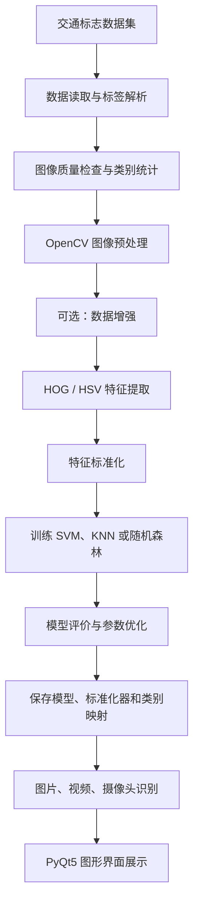

# 交通标志分类识别系统——需求分析

## 1. 项目概述

### 1.1 项目名称
**基于 OpenCV 与支持向量机的交通标志分类识别系统设计与实现**

### 1.2 建设背景
交通标志自动识别是智能交通、辅助驾驶和计算机视觉中的基础任务。本项目采用传统机器学习路线：OpenCV 负责图像预处理、HOG/HSV 负责特征工程、SVM 负责多类别分类，并通过 PyQt5 提供图片、视频和摄像头场景下的演示。

项目面向计算机视觉课程设计，形成“数据集管理 → 图像预处理 → 特征提取 → 模型训练 → 模型评价 → 实时识别”的完整闭环。

### 1.3 任务边界
系统的核心是**交通标志分类**：输入为单个、已经裁剪好的交通标志图像；输出为类别编号、类别名称和置信度。

交通标志**检测**为扩展功能：输入完整道路场景，先用 HSV 颜色分割、形态学处理和轮廓筛选定位候选区域，再交由分类器判断类别。该扩展不定位为复杂道路场景下的高精度目标检测系统。

| 对比项 | 分类任务 | 检测扩展任务 |
|---|---|---|
| 输入 | 已裁剪单标志图像 | 道路场景图像、视频帧或摄像头画面 |
| 输出 | 类别与置信度 | 候选框位置、类别与置信度 |
| 技术重点 | HOG/HSV 特征、SVM 多分类 | 颜色掩膜、轮廓筛选、候选区分类 |
| 项目优先级 | 必做 | 选做/加分项 |

### 1.4 建设目标
1. 读取 GTSRB 或同类目录结构数据集，解析类别标签并统计样本分布。
2. 实现尺寸统一、灰度化、去噪、CLAHE、归一化等 OpenCV 预处理。
3. 实现 HOG、HSV 颜色直方图和 HOG+HSV 融合特征。
4. 以 HOG+SVM 作为主方案，实现 KNN、随机森林对比模型。
5. 输出准确率、分类报告、混淆矩阵、训练时间和预测耗时。
6. 保存并加载分类器、标准化器、类别映射和特征配置。
7. 提供图片、视频、摄像头固定识别框和 PyQt5 图形界面。
8. 选做：提供传统颜色与轮廓的候选标志定位。

## 2. 用户与使用场景

### 2.1 用户角色
| 用户角色 | 主要需求 |
|---|---|
| 课程设计学生 | 配置数据集、训练模型、完成对比实验、导出评价图表并演示系统 |
| 指导教师/答辩评审 | 查看算法路线、评价指标、模型对比、识别结果和系统完整性 |
| 普通演示用户 | 选择图片或视频、打开摄像头、查看预测类别与置信度 |

### 2.2 典型使用场景
1. **数据准备**：将数据集放入 `dataset/train/<class_id>/`，配置 `labels.csv`，检查类别数量与异常图片。
2. **离线训练**：选择预处理、特征和分类器，训练模型并保存模型包。
3. **模型评价**：查看 Accuracy、分类报告、混淆矩阵及易混淆类别。
4. **图片识别**：选择本地图片，显示原图、预处理图、类别名称和置信度。
5. **视频识别**：逐帧预测，支持暂停、继续、停止与结果视频导出。
6. **摄像头识别**：将单个标志放置在画面中央识别框内，系统实时分类。
7. **检测扩展**：输入道路场景，定位红色/蓝色候选区域并分类。

## 3. 总体业务流程

## 4. 功能需求

### 4.1 数据集管理
| 编号 | 需求 | 说明 | 优先级 |
|---|---|---|---|
| FR-01 | 数据集路径配置 | 配置训练集、测试集、标签文件路径 | 高 |
| FR-02 | 数据读取 | 读取类别目录内 `jpg/jpeg/png/ppm/bmp` 等图片 | 高 |
| FR-03 | 标签解析 | 读取 `labels.csv`，建立类别 ID 与类别名称映射 | 高 |
| FR-04 | 异常图片处理 | 跳过损坏、无法读取或尺寸异常的图片并记录日志 | 中 |
| FR-05 | 样本统计 | 统计每类样本数、总样本数和类别分布 | 中 |
| FR-06 | 数据分布图 | 输出类别数量柱状图 | 中 |

### 4.2 图像预处理与增强
| 编号 | 需求 | 说明 | 优先级 |
|---|---|---|---|
| FR-07 | 尺寸统一 | 默认缩放至 64×64；允许用于实验的 32×32、48×48 配置 | 高 |
| FR-08 | 灰度化 | BGR 转灰度图，作为 HOG 主流程输入 | 高 |
| FR-09 | 去噪 | 支持 3×3 高斯滤波 | 中 |
| FR-10 | 对比度增强 | 支持不增强、直方图均衡化与 CLAHE | 高 |
| FR-11 | 颜色空间转换 | 支持 BGR 转 HSV/YUV，用于颜色特征和对比实验 | 中 |
| FR-12 | 归一化 | 支持 Min-Max 或像素除以 255 的归一化 | 中 |
| FR-13 | 增强 | 支持小角度旋转、平移、缩放、亮度/对比度、轻微噪声和模糊 | 中 |
| FR-14 | 语义约束 | 默认禁止水平翻转，避免改变左右转、数字和文字语义 | 高 |

### 4.3 特征、训练与模型管理
| 编号 | 需求 | 说明 | 优先级 |
|---|---|---|---|
| FR-15 | HOG 特征 | 使用固定 HOG 参数提取形状特征 | 高 |
| FR-16 | HSV 特征 | 计算 H、S 通道二维颜色直方图 | 中 |
| FR-17 | 特征融合 | 支持 HOG、HSV、HOG+HSV 三种模式 | 高 |
| FR-18 | 分层划分 | 支持 80/20 或 70/15/15，并使用 `stratify=y` | 高 |
| FR-19 | 特征标准化 | SVM/KNN 的 scaler 仅能在训练集上拟合 | 高 |
| FR-20 | SVM 训练 | 支持 RBF SVM，并可配置 `C`、`kernel`、`gamma` | 高 |
| FR-21 | 对比模型 | 支持 KNN 与随机森林训练 | 中 |
| FR-22 | 参数搜索 | 支持 SVM 的 C、核函数等网格搜索 | 中 |
| FR-23 | 模型保存 | 保存分类器、scaler、类别映射、特征配置和训练摘要 | 高 |
| FR-24 | 模型加载 | 校验模型包完整性后加载预测资源 | 高 |

### 4.4 模型评价与识别展示
| 编号 | 需求 | 说明 | 优先级 |
|---|---|---|---|
| FR-25 | 准确率 | 输出测试集 Accuracy | 高 |
| FR-26 | 分类报告 | 输出每类 Precision、Recall、F1 和样本数 | 高 |
| FR-27 | 混淆矩阵 | 生成矩阵和可视化图片 | 高 |
| FR-28 | 错误样本分析 | 导出真实类别、预测类别和置信度 | 中 |
| FR-29 | 多模型比较 | 汇总准确率、宏平均指标、训练/预测耗时、模型大小 | 中 |
| FR-30 | 单图预测 | 输出类别 ID、类别名称和置信度 | 高 |
| FR-31 | 置信度显示 | 仅在模型支持 `predict_proba` 时显示概率；否则明确不可用 | 中 |
| FR-32 | 图片界面 | 显示原图、预处理图和预测信息 | 高 |
| FR-33 | 视频界面 | 逐帧识别，支持暂停/继续/停止和结果视频保存 | 中 |
| FR-34 | 摄像头界面 | 实时分类中央固定 ROI，支持截图保存 | 中 |
| FR-35 | 评价展示 | GUI 中查看当前模型指标与混淆矩阵 | 中 |

### 4.5 传统检测扩展
| 编号 | 需求 | 说明 | 优先级 |
|---|---|---|---|
| FR-36 | HSV 颜色掩膜 | 检测红色与蓝色候选区域 | 低 |
| FR-37 | 形态学处理 | 开闭运算去除噪声、填补区域 | 低 |
| FR-38 | 轮廓筛选 | 面积、长宽比、圆度或多边形近似筛选 | 低 |
| FR-39 | 候选区分类 | 候选区域缩放后调用已有分类器 | 低 |
| FR-40 | 结果绘制 | 绘制候选框、类别和置信度 | 低 |

## 5. 非功能需求

### 5.1 性能
1. 单张 64×64 标志图像应在普通 CPU 上快速预测，目标为 1 秒内返回结果。
2. 视频和摄像头模式不得阻塞 GUI 主线程；使用 `QTimer` 或 `QThread` 获取帧。
3. 训练过程应输出进度、耗时、样本量和异常信息。
4. 完整 GTSRB 数据上 RBF SVM 训练较慢时，应允许使用 LinearSVC、抽样数据或降低网格搜索规模。

### 5.2 可用性
1. 界面提供“选择图片、选择视频、打开摄像头、停止识别、保存结果、模型评价”等明确按钮。
2. 未加载模型、视频读取失败、摄像头不可用时必须显示可理解的中文提示，不得崩溃。
3. 识别结果至少显示类别名称、类别编号、置信度、当前模型和特征模式。
4. 文件对话框应过滤常见图片与视频格式。

### 5.3 可靠性与可复现性
1. 无法读取的图片、视频帧或损坏模型不得导致批处理任务整体中断。
2. 使用固定 `random_state=42`，记录训练参数和数据划分信息。
3. 测试集不可参与 scaler 拟合、参数选择或数据增强；增强仅对训练集生效。
4. 模型、scaler、标签映射与特征配置必须以同一版本保存，防止预测阶段不一致。

### 5.4 可维护性与环境
| 项目 | 要求 |
|---|---|
| 代码组织 | 按数据、预处理、特征、模型、评价、识别、UI 分层 |
| 配置管理 | 路径、HOG、预处理与模型参数集中维护 |
| 测试 | 预处理、特征、数据加载、模型管理、预测均应具备测试 |
| 操作系统 | Windows 10/11 优先，理论兼容其他支持 Python 的系统 |
| Python | Python 3.10 或 Python 3.11 |
| 硬件 | 普通 CPU、建议 8 GB 内存以上，不依赖 GPU |
| 第三方库 | OpenCV、NumPy、Pandas、scikit-learn、Joblib、Matplotlib、PyQt5 |

## 6. 输入、输出与数据要求

| 类型 | 输入/输出内容 |
|---|---|
| 训练输入 | 按类别目录组织的 `jpg/jpeg/png/ppm/bmp` 图像与标签 CSV |
| 预测输入 | 本地单张图片、视频文件、摄像头画面或检测候选区域 |
| 模型输出 | `classifier.joblib`、`scaler.joblib`、类别映射、特征配置、训练摘要 |
| 评价输出 | Accuracy、分类报告、混淆矩阵、错误样本图、模型对比表 |
| 演示输出 | 原图、预处理图、预测叠加图、结果视频、截图、识别记录 |

数据质量要求：类别目录必须可解析；每个参与训练的类别样本数不得为零；读取失败的路径应记录；数据划分必须分层；训练、验证、测试之间不得产生泄漏。

## 7. 约束与风险

| 风险/约束 | 影响 | 应对措施 |
|---|---|---|
| RBF SVM 训练耗时高 | 完整数据训练慢 | 先小规模调试，使用 LinearSVC 或缩小搜索范围 |
| 类别不均衡 | 高频类别可能主导结果 | 分层划分、宏平均指标、混淆矩阵分析 |
| 灰度 HOG 丢失颜色 | 形状相似类别容易混淆 | 增加 HSV 颜色直方图并对比 HOG+HSV |
| 水平翻转改变语义 | 训练标签错误 | 禁用翻转，增强策略配置化 |
| 传统检测对光照敏感 | 复杂场景定位不稳定 | 明确为扩展演示，阈值与筛选条件可配置 |
| 摄像头画面位置不确定 | 分类器不能自动找标志 | 使用中央固定识别框 |
| 模型与配置不一致 | 特征维度错误或结果异常 | 同版本模型包中保存并校验元信息 |

## 8. 验收标准

### 基础验收
- 能读取数据集、输出样本统计并跳过异常图片。
- 能完成 64×64 缩放、灰度/CLAHE、HOG 特征、分层划分和 SVM 训练。
- 能输出 Accuracy、分类报告、混淆矩阵。
- 能保存并重新加载模型，完成单张图片预测。

### 标准验收
- 完成 KNN、SVM、随机森林模型对比，以及 HOG、HSV、HOG+HSV 特征对比。
- 支持错误样本分析、本地视频和摄像头固定区域识别。
- 支持保存识别结果及模型评价图表。

### 高分扩展验收
- 支持网格搜索、数据增强和鲁棒性测试。
- 支持颜色/轮廓候选区域定位和分类。
- 可选实现传统方法与 CNN 的对照实验，并阐明两者适用边界。

## 9. 成功判定
当系统在固定数据集上完成“数据读取、训练、评价、模型保存/加载、图片/视频/摄像头识别”的完整闭环，并能输出可复现的模型与实验结果时，即满足课程设计核心目标。报告中应说明分类与检测扩展的边界、模型选择理由、易混淆类别、系统局限性和后续改进方向。
